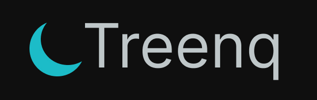

    

### treenq

It's a Platform as a Code to let you deliver, build, manage cloud resource and dependencies right from the code in order to:

- get rid of .env files
- give 0 buttons clicking on a platform
- provide easy debugging across the system
- testable infra
- pluggable system

## API Design

TBD

## Internal tech

### CDK

Treenq CDK is responsible for defining infrastracture setup given from the user's `space` state.
It uses only postgres as a dependency. However, any other persistent storage can be implemented as a infra state store.

## Contributor guide

#### How to run it locally

- install go https://go.dev/doc/install
- install docker/colima/podman in order to run docker-compose dev environment
- for mac: install macfuse `brew install macfuse` in order to support overlafs on the host machine to run the app inside a docker container
- run the dev environment using `docker compose up` or `docker-compose up`
- run `go run cmd/server/main.go`
